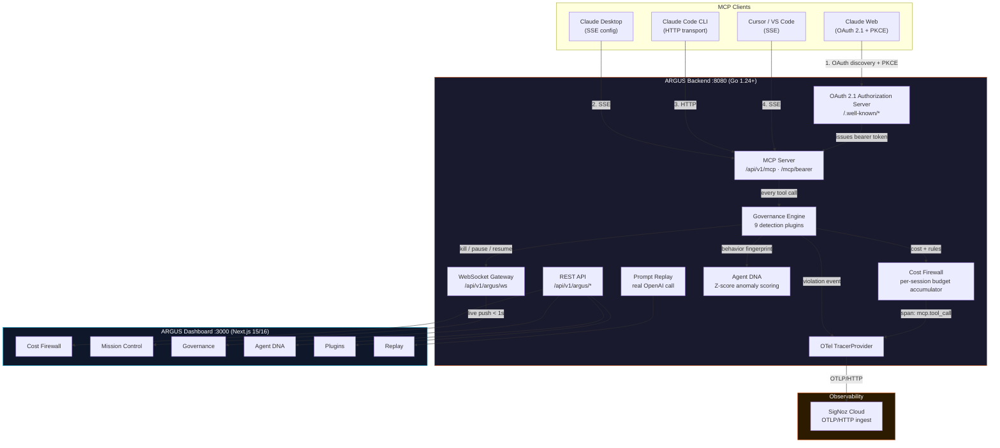
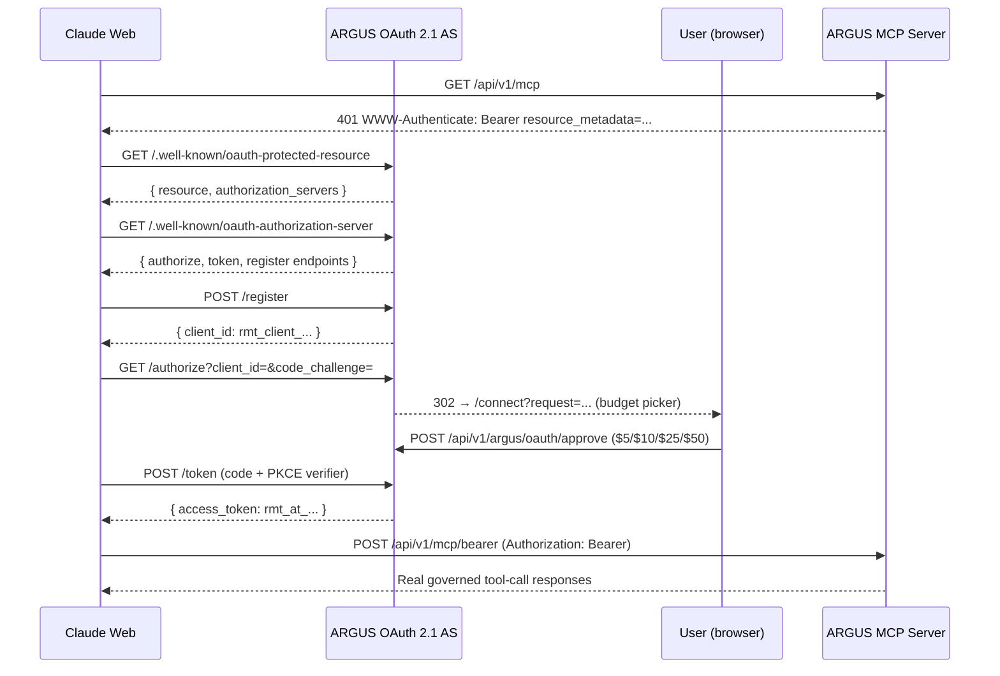
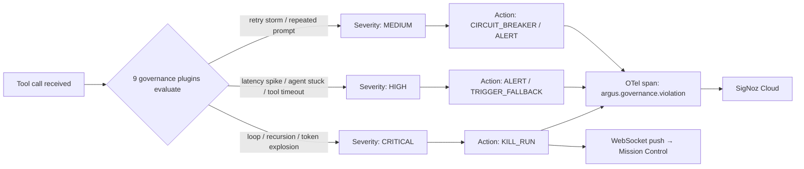

<div align="center">


# ARGUS — AI Agent Runtime Governance & Cost Firewall

**The autonomous runtime control plane that observes, meters, and enforces policy on every MCP tool call your AI agents make — in real time.**

ARGUS intercepts every Claude / MCP tool call, evaluates it against 9 governance plugins, meters it against a live cost budget, and streams the result to an OpenTelemetry pipeline — with a one-click kill switch when an agent goes rogue.

[](https://argus-signoz.netlify.app/)
[](https://drive.google.com/file/d/1GVkP8SiEnUFbBV9UFtuOE0PdfDZZbAdr/view)
[](https://github.com/Aaditya1273/Argus)
[](./LICENSE)
[](https://go.dev)
[](https://nextjs.org)
[](https://modelcontextprotocol.io)
[](https://oauth.net/2.1/)
[](https://signoz.io)
[](./SECURITY.md)

**[🚀 Live Dashboard](https://argus-signoz.netlify.app/) · [🎥 Video Walkthrough](https://drive.google.com/file/d/1GVkP8SiEnUFbBV9UFtuOE0PdfDZZbAdr/view) · [📦 Source](https://github.com/Aaditya1273/Argus) · [🔌 Connect Claude](#-connect-claude-in-under-2-minutes) · [🛡️ Security](./SECURITY.md)**

</div>

---

## Table of Contents

1. [Executive Summary & Impact Metrics](#-executive-summary--impact-metrics)
2. [Architecture & Data Flow](#-architecture--data-flow)
3. [Technical Deep-Dive](#-technical-deep-dive-flagship-features)
4. [Tech Stack](#-tech-stack)
5. [Directory Structure](#-directory-structure)
6. [Quick Start](#-quick-start)
7. [Connect Claude](#-connect-claude-in-under-2-minutes)
8. [Testing & Verification](#-testing--verification)
9. [Security Controls & Roadmap](#-security-controls--roadmap)

---

## 🎯 Executive Summary & Impact Metrics

### The Problem

Autonomous AI agents built on the **Model Context Protocol (MCP)** call tools — file reads, shell commands, code search — with no metering, no budget enforcement, and no behavioral baseline. A single prompt-injected loop or a stuck agent can silently burn thousands of tool calls, exfiltrate data via unrestricted `run_command` execution, or blow through an API budget before a human notices. There is no **runtime control plane** standing between the agent's intent and the tool's execution.

### The Solution

ARGUS sits as a **governed MCP server** between any MCP client (Claude Web, Claude Desktop, Claude Code, Cursor, VS Code) and the underlying tools. Every call is intercepted at the transport layer, evaluated by a **governance rule engine** (Z-score anomaly detection, loop/recursion detection, budget enforcement), metered by a **cost firewall accumulator**, exported as an **OpenTelemetry span** to SigNoz Cloud, and — if a rule fires — killed, paused, or circuit-broken in real time via WebSocket.

### Benchmark Table

| Metric | Value | Mechanism |
|---|---|---|
| Tool-call interception latency | Sub-millisecond overhead | In-process middleware on `/api/v1/mcp/bearer` |
| Governance plugins active | 9 / 9 by default | Zero-config rule engine |
| Live agent state propagation | < 1s to Mission Control UI | Gorilla WebSocket broadcast |
| OAuth 2.1 handshake | 8-step PKCE (S256) flow | RFC 9207–compliant discovery |
| Cost-firewall granularity | Per-session, per-tool-call | Budget accumulator, $5–$100 tiers |
| Anomaly scoring | 0–100 Z-score deviation | Agent DNA behavioral fingerprinting |
| Telemetry export | OTLP/HTTP → SigNoz Cloud | `BatchSpanProcessor` + `otlptracehttp` |

---

## 🏗️ Architecture & Data Flow

### System Architecture



### OAuth 2.1 + PKCE Sequence (Claude Web)



### Governance Decision Path



---

## 🔬 Technical Deep-Dive: Flagship Features

### 1. Cost Firewall — Per-Session Budget Enforcement

Each MCP session is bound to a budget accumulator ($5 / $10 / $25 / $50 tiers, or a custom `ARGUS_BUDGET_LIMIT`). Every tool call is priced (e.g. `read_file` = $0.001, `run_command` = $0.003) and atomically added to the session's running total on `POST /api/v1/mcp/bearer`. When cumulative burn crosses the threshold, the **Budget Exceeded** plugin fires `KILL_RUN`, the bearer token is revoked mid-connection, and an `argus.budget.exceeded` span is emitted with `argus.total_burn_usd` and `argus.budget_limit_usd` attributes — closing the loop before a runaway agent generates a billing surprise.

### 2. Agent DNA — Z-Score Behavioral Fingerprinting

For every tracked agent, ARGUS computes a rolling baseline of average cost per run, average and p95 latency, and tool-usage distribution. New sessions are scored against that baseline using **Z-score deviation** to produce a 0–100 anomaly score. A `search_code` call frequency that spikes 100× above baseline — a classic prompt-injection or infinite-loop signature — trips the "Drift Detected" flag without any manual thresholding, useful for both real-time defense and after-the-fact compliance evidence.

### 3. Governance Rule Engine — 9 Concurrent Detection Plugins

Every tool call is streamed through a plugin pipeline (infinite tool loop, token explosion, budget exceeded, latency spike, agent stuck, retry storm, repeated prompt, prompt recursion, tool timeout) evaluated **in-line, synchronously**, before the tool result returns to the agent. Each plugin owns a severity (CRITICAL/HIGH/MEDIUM) and a bound recovery action (`KILL_RUN`, `ALERT`, `CIRCUIT_BREAKER`, `TRIGGER_FALLBACK`) — a fail-closed design where governance evaluation is on the hot path, not a side-channel audit log.

### 4. Prompt Replay — Trace Reconstruction & Real LLM Re-Execution

Given a trace ID captured from Mission Control, ARGUS reconstructs the original tool-call context and re-executes it against a live OpenAI model (`gpt-4o-mini` by default) with an optionally modified prompt, returning a side-by-side diff of latency delta, cost delta, and response content — turning a governance dashboard into a debugging and prompt-engineering workbench.

### 5. OAuth 2.1 Authorization Server — Self-Hosted, PKCE-Enforced

Rather than delegating identity to a third party, ARGUS runs its own in-process **OAuth 2.1 Authorization Server** exposing `/.well-known/oauth-protected-resource` and `/.well-known/oauth-authorization-server` discovery, dynamic client registration (`/register`), and an `S256` PKCE-only `/authorize` → `/token` exchange — the exact discovery contract Claude Web expects from a remote MCP connector, with a human-in-the-loop budget-approval step inserted before token issuance.

---

## 🧰 Tech Stack

| Layer | Technology | Architectural Purpose |
|---|---|---|
| **Core Runtime** | Go 1.24+, `gorilla/mux` | HTTP routing for MCP + REST + OAuth endpoints, high concurrency, low GC overhead |
| **Real-Time Transport** | Gorilla WebSocket | Sub-second state sync between backend agent state and Mission Control UI |
| **Governance Engine** | Custom Go plugin pipeline | Synchronous, in-line rule evaluation on the tool-call hot path |
| **Cost Firewall** | In-memory accumulator (DB-ready) | Atomic per-session budget tracking with thread-safe increment |
| **Auth Layer** | OAuth 2.1 Authorization Server, PKCE S256 | Zero-trust, code-flow-only auth for remote MCP clients (no implicit grant) |
| **Frontend** | Next.js 15/16, React 19, Tailwind CSS | Server-rendered dashboard with streaming WebSocket state |
| **Observability** | OpenTelemetry SDK, OTLP/HTTP exporter | Vendor-neutral span export decoupled from the storage backend |
| **Telemetry Backend** | SigNoz Cloud | Managed trace/metrics store, `service.name = argus-control-plane` |
| **LLM Integration** | OpenAI `gpt-4o-mini` (Prompt Replay) | Real re-execution for trace diffing, gated behind `ARGUS_LLM_API_KEY` |
| **Protocol** | Model Context Protocol `2024-11-05` | Standardized tool-call contract between agent and control plane |
| **Python SDK** | `argus-sdk` (pip-installable) | `@argus.enforce` decorator for non-MCP agent instrumentation |
| **Testing** | Go `testing`, Python `pytest`, Playwright | Unit, integration, and E2E coverage across backend and dashboard |
| **Deployment** | Docker, `docker-compose.prod.yaml`, Railway, Render, Netlify | Multi-target deploy for backend container + static/edge frontend |

---

## 📂 Directory Structure

```text
Argus/
├── cmd/
│   ├── argus-server/        # Main backend entrypoint (main.go, Dockerfile)
│   └── argus-cli/           # CLI client for scripted governance ops
├── pkg/
│   └── query-service/
│       └── argus/           # Governance engine, cost firewall, telemetry, OAuth AS
│           └── telemetry/   # OTel tracer bootstrap → SigNoz Cloud
├── frontend/                 # Next.js 15/16 dashboard (Cost Firewall, Mission Control, DNA…)
├── argus-sdk/                 # pip-installable Python SDK (@argus.enforce)
├── agent-skills/              # MCP agent skill definitions
├── deploy/                    # Deployment manifests (Railway / Render / Docker)
├── demo/                       # verify.py — 20-check real end-to-end verification
├── docs/                        # Architecture & protocol documentation
├── tests/                        # Unit, integration (pytest) & E2E (Playwright) suites
├── integrations/                  # Third-party connector glue
├── .env.example                    # Required environment variables (see below)
├── docker-compose.prod.yaml         # Production container topology
├── Dockerfile                        # Backend multi-stage build (Go 1.24-alpine)
├── SECURITY.md                        # Vulnerability disclosure policy
└── LICENSE
```

---

## 🚀 Quick Start

### Prerequisites

| Requirement | Version | Purpose |
|---|---|---|
| Go | `>= 1.24.x` | Backend build/runtime |
| Node.js | `>= 20.x` | Dashboard build/runtime |
| SigNoz Cloud account | Free tier works | Trace ingestion (`signoz.io`) |
| OpenAI API key | — | Enables real Prompt Replay |

### 1 — Clone & configure environment

```bash
git clone https://github.com/Aaditya1273/Argus.git
cd Argus
cp .env.example .env.local
```

**`.env.example`** (fill in your own values in `.env.local`):

```bash
# --- SigNoz Cloud (Settings → Ingestion Settings) ---
OTEL_EXPORTER_OTLP_ENDPOINT="https://ingest.in2.signoz.cloud"
OTEL_EXPORTER_OTLP_HEADERS="signoz-ingestion-key=YOUR_KEY"

# --- OpenAI (enables real Prompt Replay) ---
ARGUS_LLM_API_KEY="sk-..."
# OPENAI_API_KEY="sk-..."          # alternate var name, also honored

# --- Core service identity ---
# ARGUS_ADDR=":8080"
# ARGUS_ORG_ID="default"
# ARGUS_PUBLIC_BASE="http://localhost:8080"   # set to your deployed URL in prod
# ARGUS_DASHBOARD_BASE="http://localhost:3000"

# --- Cost Firewall ---
# ARGUS_BUDGET_LIMIT="100"          # global per-session budget ceiling ($)

# --- Optional integrations ---
# ARGUS_CLICKHOUSE_DSN=""           # persistent storage backend (optional)
# ARGUS_WEBHOOK_URL=""              # generic incident webhook
# SLACK_WEBHOOK_URL=""              # Slack incident notifications
```

### 2 — Start the backend

```bash
go run cmd/argus-server/main.go
```

Expected output:

```text
INFO ARGUS: SigNoz Cloud credentials loaded  endpoint=https://ingest.in2.signoz.cloud
INFO ARGUS: OAuth 2.1 discovery base         public_base=http://localhost:8080
INFO argus: MCP server initialized           endpoint=/api/v1/mcp
INFO ARGUS server starting                   addr=:8080
```

### 3 — Start the dashboard

```bash
cd frontend && npm install && npm run dev
```

Open **http://localhost:3000**

### 4 — Or run everything via Docker Compose

```bash
docker compose -f docker-compose.prod.yaml up --build
```

---

## 🔌 Connect Claude in Under 2 Minutes

Go to **`http://localhost:3000/plugins`** → click **"Add to Claude Web."** Claude redirects to the ARGUS consent screen, you pick a budget ($5 / $10 / $25 / $50), approve — ARGUS is now governing every tool call Claude makes.

| Client | Method | How |
|---|---|---|
| **Claude Web** | OAuth 2.1 + PKCE | Click **"Add to Claude Web"** on the Plugins page |
| **Claude Desktop** | SSE | Add the config file shown on the Plugins page |
| **Claude Code** | HTTP | `claude mcp add --transport http argus http://localhost:8080/api/v1/mcp` |
| **Cursor** | SSE | Click the **"Cursor"** chip on the Plugins page |
| **VS Code** | SSE | Click the **"VS Code"** chip on the Plugins page |

### MCP Tools Exposed to Claude

| Tool | Cost | Function |
|---|---|---|
| `read_file` | $0.001 | Read any file in the project |
| `search_code` | $0.002 | Ripgrep search across the codebase |
| `list_directory` | $0.001 | List directory contents |
| `analyze_codebase` | $0.005 | Language breakdown + file metrics |
| `run_command` | $0.003 | Execute shell commands (`bash -c`) |
| `argus_list_agents` | $0.001 | List all agents tracked by ARGUS |
| `argus_cost_status` | $0.001 | Get current budget/burn status |
| `argus_agent_dna` | $0.002 | Get behavioral fingerprint for a trace |
| `signoz_query_traces` | $0.002 | Query SigNoz trace data |
| `signoz_get_services` | $0.001 | List SigNoz-monitored services |
| `signoz_list_alerts` | $0.001 | List SigNoz alert rules |
| `signoz_create_dashboard` | $0.005 | Create a SigNoz dashboard |

### Python SDK (non-MCP agent instrumentation)

```bash
cd argus-sdk && pip install -e .
```

```python
import argus

argus.init(
    agent_id="my-sales-agent",
    telemetry_endpoint="http://localhost:4318",
    control_plane_url="ws://localhost:8080/api/v1/argus/agent-ws",
)

@argus.enforce
def my_agent_loop():
    # ARGUS intercepts every call, checks for kill/pause signals
    ...
```

---

## 🧪 Testing & Verification

```bash
# Go unit + package tests
go test ./...

# Full 20-check real end-to-end verification (OAuth flow, live MCP calls,
# governance rules, SigNoz connectivity, agent tracking — no mocks)
go run cmd/argus-server/main.go &
python3 demo/verify.py

# Python integration suite (pytest, fixtures in tests/fixtures)
cd tests && uv run pytest integration/

# Dashboard end-to-end (Playwright)
cd tests/e2e && npm install && npx playwright test
```

**Coverage types implemented:**

- ✅ **Unit tests** — Go governance plugin logic, cost accumulator math
- ✅ **Integration tests** — Python `pytest` fixtures against a live backend (Postgres/ClickHouse fixtures included)
- ✅ **End-to-end tests** — Playwright against the running Next.js dashboard
- ✅ **Real-system verification** — `demo/verify.py`, 20 checks against a live server, zero mocked responses

---

## 🛡️ Security Controls & Roadmap

### Governance Plugins (9 active by default)

| Plugin | Detects | Severity | Action |
|---|---|---|---|
| Infinite Tool Loop | Same tool called >5× in a row | CRITICAL | `KILL_RUN` |
| Token Explosion | Single call uses >10k tokens | CRITICAL | `KILL_RUN` |
| Budget Exceeded | Session cost > limit | CRITICAL | `KILL_RUN` |
| Prompt Recursion | Prompt contains its own output | HIGH | `KILL_RUN` |
| Latency Spike | Response time >5× baseline | HIGH | `TRIGGER_FALLBACK` |
| Agent Stuck | No progress for >2 minutes | HIGH | `ALERT` |
| Tool Timeout | Tool call exceeds 30s | HIGH | `ALERT` |
| Retry Storm | Same operation retried >10× | MEDIUM | `CIRCUIT_BREAKER` |
| Repeated Prompt | Same prompt sent >3× | MEDIUM | `ALERT` |

### Security Mitigations

- **PKCE-only OAuth 2.1** (`S256`) — no implicit grant, no plaintext code interception
- **Human-in-the-loop budget approval** before every session's bearer token is issued
- **Per-session cost isolation** — one agent's burn cannot exhaust another session's budget
- **Fail-closed governance** — rule evaluation runs synchronously in the tool-call path, not as an async audit log
- **Kill/pause/resume authority** decoupled from the agent's own UI — a compromised or looping agent cannot block its own shutdown
- See [`SECURITY.md`](./SECURITY.md) for the full vulnerability-disclosure policy and scope

> ⚠️ **Operational note:** `run_command` executes arbitrary shell commands. In multi-tenant or internet-facing deployments, pair it with an explicit command allowlist, a restricted working directory, and OS-level resource limits — this is on the roadmap below.

### Roadmap

- [x] OAuth 2.1 + PKCE authorization server
- [x] 9-plugin governance engine with live kill/pause/resume
- [x] Cost Firewall with per-session budgeting
- [x] Agent DNA behavioral fingerprinting (Z-score anomaly)
- [x] OTel → SigNoz Cloud trace export
- [x] Prompt Replay against real OpenAI models
- [x] Python SDK (`@argus.enforce`) for non-MCP agents
- [ ] Command allowlist / sandbox for `run_command`
- [ ] Persistent policy storage (ClickHouse/Postgres-backed, beyond in-memory)
- [ ] Multi-tenant org/RBAC support for the OAuth AS
- [ ] Token-level (not just call-level) real LLM cost accounting
- [ ] Claude-native Prompt Replay (in addition to OpenAI)

---

<div align="center">

**[🚀 Live Dashboard](https://argus-signoz.netlify.app/) · [🎥 Video Walkthrough](https://drive.google.com/file/d/1GVkP8SiEnUFbBV9UFtuOE0PdfDZZbAdr/view) · [📦 GitHub](https://github.com/Aaditya1273/Argus) · [🛡️ Report a Vulnerability](./SECURITY.md)**

Built on **Go**, **Next.js**, **OpenTelemetry**, **Model Context Protocol**, and **OAuth 2.1** — governing AI agent runtimes in production.

</div>